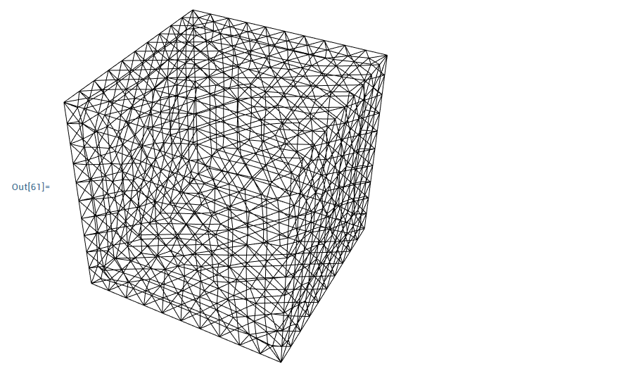
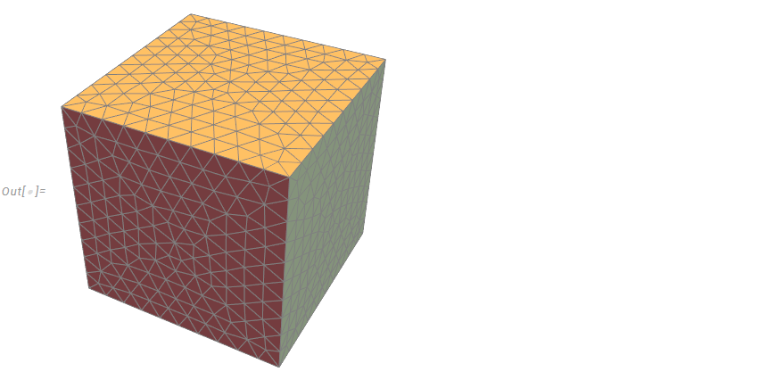

# Mesh converter
## Description
Mesh converter to import Comsol Multiphysics meshes into Mathematica.

## Instruction

1. Export the mesh from Comsol as `.mphtxt` 
2. Clone the repository

```shell
git clone https://github.com/mastroalex/mesh-importer.git
```

3. Run the `meshConversion.py` script

```shell
python meshConversion.py
```

The python script works with three different mode:
- Script without any arguments will open a GUI asking for the `mesh.mphtxt` file. The output path is set as `/meshOutput/`.
- Script with one argument accepts for the `mesh.mphtxt` file path.

```shell
python meshConversion.py <path/to/mesh/mesh.mphtxt>
```
- Script with two arguments accepts for both the `mesh.mphtxt` file path and the output path

```shell
python meshConversion.py <path/to/mesh/mesh.mphtxt> <output/path>
```

## Mathematica integration

It is possibile to integrate it directly into Mathematica using the `ExternalEvaluate[]` function.

```mathematica
ExternalEvaluate["Shell", "cd " <> NotebookDirectory[] <> "\n git clone \ https://github.com/mastroalex/mesh-importer.git "]
py = "C:/Users/bigba/AppData/Local/Programs/Python/Python310/python.exe";
meshPath = "C:/mesh/path/to/mesh.mphtxt";
meshOutput = "C:/mesh/output/path";
ExternalEvaluate["Shell", py <> " " <> NotebookDirectory[] <> "/mesh-importer/meshConversion.py" <> " " <> meshPath <> " " <>   meshOutput]
```

### Load and visualize

Example to load tetrahedral quadratic mesh with O2 elements:

```mathematica
nodes = Import[meshOutput <> "\\nodes.txt", "Table"];
connectivity = Import[meshOutput <> "\\Elements_O2.txt", "Table"];
```

#### Built-in 

Create and visualize mesh: 

```mathematica
Needs["NDSolve`FEM`"]
mesh = ToElementMesh["Coordinates" -> nodes, "MeshElements" -> {TetrahedronElement[connectivity[[All, {1, 2, 4, 3}]]]}]
mesh["Wireframe"]
```




#### AceFEM

```mathematica
<< AceFEM`;
SMTInputData[];
SMTAddDomain[{"\[CapitalOmega]c", "O2P1Y", {}}];
SMTAddMesh[  nodes, {"\[CapitalOmega]c" -> connectivity[[All, {1, 2, 4, 3, 5, 9, 8, 6, 7, 10}]]}];
SMTAnalysis[];
SMTShowMesh["DeformedMesh" -> False, "Field" -> None]
```



---

More info about the Mathematica usage: [MeshImporter.nb](https://github.com/mastroalex/mesh-importer/blob/main/data/MeshConverter.nb)

